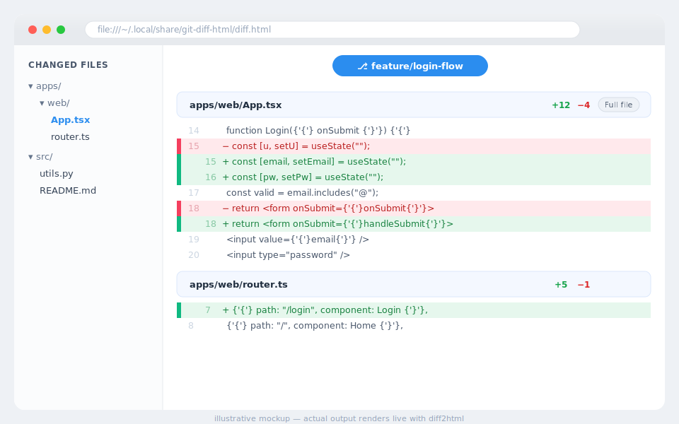

<p align="center">
  
</p>

# git-diff-html

A [Claude Code](https://claude.com/claude-code) skill that renders `git diff` as a
side-by-side HTML page and opens it in Safari. No MCP server required.

It captures the diff, builds a self-contained HTML page with
[diff2html](https://diff2html.xyz/) (loaded from CDN), adds a light-blue worktree
banner plus sticky per-file headers, and launches Safari.

## Preview

<p align="center">
  
</p>

## Install

Copy the skill into your Claude Code skills directory:

```bash
mkdir -p ~/.claude/skills/git-diff-html
cp SKILL.md render_git_diff.py ~/.claude/skills/git-diff-html/
```

## Usage

In Claude Code, say `/git-diff-html`, `gdh`, or "show diff in safari". Or run the
script directly from inside the repo you want to diff:

```bash
python3 ~/.claude/skills/git-diff-html/render_git_diff.py "$@"
```

`$@` accepts anything valid after `git diff`:

- *(no args)* → defaults to `HEAD` (staged + unstaged)
- `--staged` / `--cached` → staged only
- `main..HEAD` → branch diff
- `HEAD~3 -- apps/frontend` → range scoped to a path
- `--no-open` → write the file but don't launch Safari

The script prints the output path and file count, or `No changes to diff.` when
the diff is empty.

## Behavior

- Writes to `~/.local/share/git-diff-html/diff.html`, overwriting each run.
- Read-only: runs `git diff` only — never stages, commits, or touches the working tree.
- Self-contained except for the diff2html CDN bundle (needs network to render).

## Requirements

- macOS (opens Safari)
- Python 3
- Network access for the diff2html CDN bundle

## License

MIT
